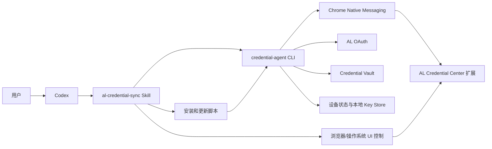

# AL Credential Sync Skill 详细设计

状态：Skill v1 已实现

目标仓库：`credential-skill`

建议 Skill 名称：`al-credential-sync`

实现目录：仓库根目录

兼容说明：当前发布版 `credential-agent` 尚未完整提供本文建议的 JSON/JSONL 机器接口。Skill 优先探测机器接口；旧版 Agent 仅使用公开命令和退出码，不在脚本中解析中文输出。机器接口补齐后无需改变 Skill 的用户语义。

最后更新：2026-07-17

## 1. 背景

AL 凭据中心已经具备以下核心能力：

- 个人电脑和云电脑统一设备入网。
- OAuth Device Flow 用户登录。
- 配对码批准云电脑。
- 自定义 Secret、环境变量、复合凭据、配置文件和网站会话同步。
- Agent 本地加密、设备密钥、设备授权和后台同步。
- Chrome/Chromium Native Messaging；Linux 同时支持默认目录和受管浏览器显式 `--user-data-dir` 对应的用户级 Native Messaging Host 目录。
- 浏览器扩展制品签名、下载、校验、解压和版本检查。
- macOS LaunchAgent、Windows 计划任务和 Linux `systemd --user`。

当前最大的使用障碍不是协议能力，而是安装和操作流程仍然暴露了较多实现细节：

- 用户需要判断操作系统和 CPU 架构。
- 用户需要自行下载、校验和安装 Agent。
- 用户需要理解本地电脑与云电脑的不同初始化方式。
- 用户需要复制配对码并在另一台设备批准。
- Chrome 官方不允许未受管 Windows/macOS 静默安装商店外扩展；Linux Chromium 同样保留未打包扩展的可见安装确认。
- 用户需要进入 `chrome://extensions/`，开启开发者模式并加载未打包扩展。
- 用户需要进入扩展授权页并启用支持的网站。
- 不同凭据类型对应不同 CLI 子命令，普通用户不应被要求记忆这些命令。

本设计通过一个 Codex Skill 把这些步骤收敛为可观察、可恢复、尽可能自动的统一流程。

## 2. 设计结论

Skill 定位为 `credential-agent` 的安装和编排层，不重新实现凭据协议、加密、认证或浏览器扩展逻辑。

主机检查只从当前用户可见的浏览器启动参数中提取 `--user-data-dir` 绝对路径，不读取浏览器 Profile 内容。Skill 将该路径传给 Agent；目录校验和 Native Messaging manifest 写入仍由 Agent 负责。

最终职责关系：

```text
用户自然语言
  -> Codex
  -> al-credential-sync Skill
       -> 跨平台安装脚本
       -> credential-agent CLI
       -> 浏览器/操作系统可视化操作
       -> 状态检查和故障恢复
  -> credential-agent
       -> OAuth
       -> 设备入网
       -> 加密与同步
       -> Native Messaging
       -> 浏览器会话捕获与恢复
```

在“不使用 Chrome Web Store、不使用 Chrome Enterprise Core、不加入 AD/Entra ID、不修改 Chromium 内核”的约束下，官方 Chrome/Chromium 无法保证完全静默安装扩展。

因此浏览器安装采用以下顺序：

1. 已安装且版本正确：直接复用。
2. 可视化自动化可用：由 Codex 操作 Chrome 和系统文件选择器。
3. 自动化不可用或失败：把页面和目录准备好，只保留一次明确的人工确认。
4. Agent 持续观察扩展连接状态，用户不需要返回终端确认。

## 3. 目标

### 3.1 用户目标

个人电脑：

```text
使用 al-credential-sync 初始化这台电脑
```

期望结果：

- 自动识别操作系统和 CPU 架构。
- 自动安装或更新 `credential-agent`。
- 打开 OAuth 登录页面。
- 用户只处理能直接理解的 OAuth 登录。
- 自动启动后台 Agent。
- 自动准备 Chrome 扩展。
- 尽力自动完成加载未打包扩展。
- 无法自动完成时只要求一次最少人工操作。
- 自动打开站点授权页。
- 尽力自动启用全部支持的网站。
- 完成健康检查。

云电脑：

```text
使用 al-credential-sync 初始化这台云电脑
```

期望结果：

- 自动安装或更新 Agent。
- 自动进入云电脑配对流程。
- 显示配对码。
- 如果 Codex 同时拥有本地电脑执行通道，自动批准配对。
- 否则只向用户提供一条本地批准指令。
- 自动启动后台同步。
- 自动准备并安装浏览器扩展。
- 完成健康检查。

同步操作：

```text
把 OPENAI_API_KEY 同步到 win-cloud
把 ~/.codex/auth.json 同步到 win-cloud
把火山引擎 AK/SK 同步到 win-cloud
把所有已登录网站同步到 win-cloud
把 GitHub 和 Reddit 登录状态同步到 win-cloud
```

Skill 应自动选择正确的 Agent 命令，不要求用户记忆 CLI。

### 3.2 工程目标

- Skill 不解析不稳定的人类可读输出。
- Skill 使用 Agent 机器可读状态和明确退出码决策。
- 所有可重复、脆弱的步骤放入脚本。
- Skill 本体保持精简，使用渐进式加载。
- 不在 Skill 中保存 Access Token、Cookie、Secret 或设备私钥。
- 安装、更新、配对和同步都可以安全重试。
- 同一 Skill 同时支持 macOS、Windows 和 Linux。
- 浏览器扩展安装失败不破坏已经完成的设备入网。

## 4. 不在本期范围内

- 修改 Chromium 内核。
- 自行分发定制浏览器。
- Chrome Web Store 发布和审核。
- Chrome Enterprise Core、Microsoft Entra ID 或传统 AD 域接入。
- 绕过 Chrome 的扩展安装安全限制。
- 直接修改 Chrome Profile、Secure Preferences 或 Cookie 数据库。
- 云桌面基础设施侧自动入网。
- TPM/Secure Enclave 厂商级远程证明。
- 凭据中心治理 Web 控制台。
- 替代 `credential-agent` 的加密、设备认证和同步实现。

## 5. 设计原则

### 5.1 Agent 是能力权威

Skill 只能调用 Agent 的公开命令，不直接：

- 调用凭据中心内部 HTTP API。
- 构造 Device Credential。
- 读取或写入设备密钥文件。
- 加密或解密凭据。
- 读取 Chrome Cookie 数据库。
- 直接修改后台任务状态。

### 5.2 状态驱动而不是步骤驱动

Skill 每次执行先检查当前状态，再决定下一步。

禁止假设：

- Agent 尚未安装。
- 当前设备一定是个人电脑或云电脑。
- 设备一定需要重新配对。
- Chrome 扩展一定未安装。
- 扩展磁盘版本和运行版本一致。
- 浏览器支持的站点列表固定。

### 5.3 自动化失败必须可恢复

每个步骤都应满足：

- 可以重复执行。
- 已完成状态不会被破坏。
- 失败后能返回明确的下一步。
- 用户取消不被视为系统故障。
- 浏览器失败不会撤销设备入网。

### 5.4 人工操作必须可理解

保留的人工操作只允许是用户能够直接理解的动作：

- 在 OAuth 页面登录。
- 批准配对码。
- 在 Chrome 可见页面确认加载扩展。
- 确认网站权限或网站会话同步。
- 输入 Secret 值。

不得要求用户：

- 手工计算 SHA256。
- 查找 Agent 状态目录。
- 修改注册表。
- 编写 JSON。
- 复制 Access Token。
- 理解 Native Messaging。
- 自行判断扩展版本。

### 5.5 安全优先

- 不在命令行参数中放 Secret。
- 不把 Cookie 值输出给 Codex。
- 不把用户输入记录到日志。
- 不自动上传全部环境变量。
- 高风险凭据使用专用资源类型。
- 网站会话同步始终保留明确确认。
- UI 自动化必须在用户可见桌面执行。

## 6. 总体架构



### 6.1 动态网站策略

浏览器扩展是通用执行器，不再内置生产网站注册表。网站策略的权威来源是 Credential Vault 的 `config.sitePoliciesJSON`：

```text
受控站点配置
  -> Vault 规范化与最小权限校验
  -> policy_version + policy_digest
  -> Agent 独立校验并通过 Native Messaging v2 下发
  -> 扩展再次校验并申请精确 Origin
  -> Capture/Restore 结果绑定同一策略摘要
```

新增普通网站时只修改 Vault 配置、递增 `policy_version` 并发布 Vault 配置；不重建 Agent 或扩展。只有新增扩展尚不具备的浏览器能力时，才需要升级协议或扩展。Manifest 的 `https://*/*` 只是 `optional_host_permissions` 声明上界，运行时禁止申请该通配权限。

个人电脑在 `browser setup` 时获取全部启用策略。仅设备授权的云电脑不具备用户控制面 Token，可以在首次 Restore 任务中获得对应策略；若 Chrome 尚未授予该 Origin，扩展打开授权页，Agent 等待用户确认后自动重试。

## 7. Skill 包结构

仓库根目录本身就是 Skill，可直接作为安装源：

```text
credential-skill/
├── SKILL.md
├── agents/
│   └── openai.yaml
├── scripts/
│   ├── bootstrap-agent-macos.sh
│   ├── bootstrap-agent-linux.sh
│   ├── bootstrap-agent-windows.ps1
│   ├── bootstrap-agent.py
│   ├── inspect-host.sh
│   ├── inspect-host.ps1
│   ├── inspect-host.py
│   ├── browser-assist-macos.sh
│   ├── browser-assist-windows.ps1
│   └── wait-agent-state.py
├── references/
    ├── agent-command-map.md
    ├── browser-installation.md
    ├── file-profiles.md
    ├── security-rules.md
    └── troubleshooting.md
└── docs/
    └── design.md
```

`SKILL.md` 控制在 500 行以内，只保留：

- 角色和职责边界。
- 主状态机。
- 何时读取哪个 reference。
- 何时运行哪个 script。
- 必须遵守的安全规则。
- 最终验收规则。

具体平台命令、文件路径、错误码和操作细节放到 `references/`。

通过 GitHub ZIP 安装时，安装器可能不保留 Unix 可执行位。Skill 必须使用 `sh scripts/*.sh`、`python3 scripts/*.py` 或 PowerShell 显式解释执行脚本，不得依赖文件模式位。

## 8. Skill 触发语义

建议 Frontmatter：

```yaml
---
name: al-credential-sync
description: Install, configure, diagnose, pair, and operate the AL credential-agent and Chrome or Linux Chromium credential extension across local computers and cloud desktops. Use when Codex needs to set up credential sync, install or update the Agent, complete OAuth or pairing, prepare the Chrome or Chromium extension, sync secrets, environment variables, credential sets, sensitive configuration files, browser sessions, dynamic credentials, or managed keys, or diagnose AL credential synchronization.
---
```

典型触发请求：

- 初始化这台电脑的凭据同步。
- 初始化一台 Windows 云电脑。
- 安装或升级 credential-agent。
- 修复 Chrome 扩展。
- 配对本地电脑和云电脑。
- 同步 Secret、环境变量或配置文件。
- 同步网站登录状态。
- 查看同步状态。
- 清理目标电脑上的网站会话。
- 诊断 Agent 过期、后台停止或浏览器未连接。

## 9. 设备角色识别

角色识别优先级：

1. 已存在的 Agent 设备状态。
2. 用户在当前请求中的明确表述。
3. 运行环境提供的可信元数据。
4. 操作系统和虚拟化信息只能作为提示。
5. 无法确定时询问用户。

不得仅因为检测到虚拟机就自动判断为云电脑。个人开发机也可能运行在虚拟化环境中。

建议 Agent 提供：

```bash
credential-agent status --output json
```

返回：

```json
{
  "initialized": true,
  "device": {
    "id": "01...",
    "name": "mac-local",
    "type": "workstation",
    "mode": "local"
  },
  "authorization": {
    "valid": true,
    "expires_at": "2026-07-17T12:00:00+08:00"
  },
  "daemon": {
    "running": true
  }
}
```

如果尚未初始化，Skill 可以询问：

```text
这台设备将作为个人电脑还是云电脑使用？
```

## 10. Agent 安装和更新

### 10.1 信任根

首次安装不能依赖尚未安装的 Agent 自更新命令，因此 Skill 的 bootstrap 脚本需要内置：

- Agent Release Manifest Ed25519 公钥。
- 默认 Artifact Base URL。
- 支持的操作系统和架构映射。
- 最大允许下载大小。

默认 Artifact Base URL：

```text
https://al-artifacts.tos-ap-southeast-1.volces.com
```

首次安装流程：

1. 获取 `credential-agent/latest.json`。
2. 获取对应版本的 `release-manifest.json`。
3. 获取 `release-manifest.sig`。
4. 验证 Ed25519 签名。
5. 选择当前平台文件。
6. 下载时显示进度并支持重试。
7. 校验文件长度和 SHA256。
8. 安装到标准路径。
9. 设置私有文件权限。
10. 执行 `credential-agent help` 验证可运行。

### 10.2 标准安装路径

macOS/Linux：

```text
~/.local/bin/credential-agent
```

Windows：

```text
%LOCALAPPDATA%\AL\CredentialAgent\credential-agent.exe
```

### 10.3 已安装 Agent

已安装时优先执行：

```bash
credential-agent update
```

更新流程必须：

- 不污染用户交互式 Shell。
- 不在当前 zsh 中设置全局 `set -euo pipefail`。
- Windows 正确处理后台 Agent 和 Native Host 文件占用。
- 下载支持进度显示、超时和断点重试。
- 失败时保留旧版本可运行文件。
- 安装完成后检查目标 SHA256。

Skill 不应因为已有版本不是最新就立即重新入网。更新 Agent 与设备授权是两个独立状态。

## 11. Agent 机器可读接口

Skill 不应解析以下文本：

```text
✓ 已启动后台同步
! Chrome 尚未连接
正在等待批准……
```

需要给 Agent 增加稳定的机器接口。

### 11.1 输出格式

当前 `pair` 和 `browser sync` 的稳定自动化接口统一使用：

```text
--output human
--output json
--output jsonl
```

默认保持 `human`。`json` 返回包含阶段数组的最终结果；`jsonl` 实时输出 `phase` 事件，并以一个 `result` 事件结束。每条机器事件包含稳定的 `operation_id`、`status`、`duration_ms`，失败时包含 `error_code`；同步任务还返回 Job ID 和各 item 状态。

JSONL 示例：

```json
{"schema_version":1,"type":"phase","command":"browser_sync","operation_id":"...","phase":"prepare_browser","status":"succeeded","duration_ms":8,"details":{"sites":["github"],"policies":{"checked":1,"already_current":1,"updated":0}}}
{"schema_version":1,"type":"result","command":"browser_sync","operation_id":"...","status":"succeeded","duration_ms":1200,"details":{"sites":["github"],"job":{"id":"...","status":"succeeded"}}}
```

JSONL 中不得包含：

- Access Token。
- Refresh Token。
- Device Credential。
- Cookie。
- Secret 值。
- 私钥材料。

### 11.2 已实现的自动化命令

```bash
credential-agent pair --approve --output json CODE
credential-agent pair --deny --output json CODE
credential-agent browser sync --to DEVICE --yes --output json SITE...
credential-agent browser sync --to DEVICE --yes --output jsonl SITE...
credential-agent browser sync --to DEVICE --yes --output jsonl --all
```

机器输出模式必须显式提供决定、目标、网站范围和同步确认；缺少这些信息时立即失败，不得进入 ReadLine。配对码不得进入结构化输出。

以下状态/浏览器分步接口仍属于后续扩展，Skill 使用前必须先做 feature detection：

```bash
credential-agent status --output json
credential-agent devices --output json
credential-agent doctor --strict --output json
credential-agent setup --skip-browser --event-format jsonl
credential-agent browser prepare --output json
credential-agent browser status --output json
credential-agent browser open-install
credential-agent browser open-permissions
credential-agent browser wait --phase connected --timeout 2m --output json
credential-agent browser wait --phase authorized --timeout 2m --output json
```

### 11.3 浏览器状态示例

```json
{
  "chrome_installed": true,
  "extension": {
    "id": "lnpfljjigmgmakiclchpnoehbbceomeb",
    "prepared": true,
    "prepared_version": "release-version",
    "directory": "/absolute/path/chrome-extension",
    "connected": true,
    "running_version": "release-version",
    "version_matches": true,
    "last_seen_at": "..."
  },
  "sites": {
    "supported": ["github", "google"],
    "authorized": ["github", "google"],
    "all_authorized": true
  }
}
```

站点列表必须来自扩展和 Agent 状态，Skill 不硬编码支持的网站数量。

## 12. 个人电脑初始化流程

### 12.1 主流程

```text
检查平台
  -> 安装或更新 Agent
  -> 读取 status
  -> 授权无效或未初始化时执行 setup --skip-browser
  -> 用户完成 OAuth
  -> 启动后台 Agent
  -> 准备浏览器扩展
  -> 自动化或辅助安装扩展
  -> 启用网站权限
  -> doctor --strict
  -> 输出完成状态
```

### 12.2 OAuth

OAuth 页面由 Agent 打开。Skill：

- 不读取页面中的密码或验证码。
- 不替用户填写身份凭据。
- 可以等待 Agent 发出 `device_enrolled` 事件。
- 超时时提示用户检查浏览器登录页面。
- 用户取消时安全结束，不删除已有状态。

### 12.3 已登录设备

如果设备授权有效且用户登录可刷新：

- 不重新登录。
- 不重新生成设备 ID。
- 不重新注册后台任务。
- 只修复缺失或不健康的组件。

## 13. 云电脑初始化流程

### 13.1 主流程

```text
检查平台
  -> 安装或更新 Agent
  -> status 判断是否已有有效设备授权
  -> 无有效授权时执行云电脑 setup
  -> 获取配对码
  -> 在已登录设备批准
  -> 启动后台 Agent
  -> 准备浏览器扩展
  -> 自动化或辅助安装
  -> doctor --strict
```

### 13.2 配对能力边界

Skill 只能直接控制当前拥有执行通道的设备。

单端执行时：

```text
云电脑生成配对码
  -> Skill 输出唯一一条本地批准命令
  -> 用户或另一个 Codex 任务在本地执行
  -> 云电脑继续轮询
```

双端均可控时：

```text
云电脑生成配对码
  -> Codex 切换到本地执行通道
  -> 展示待配对设备并取得用户决定
  -> credential-agent pair --approve|--deny --output json CODE
  -> 返回云电脑等待完成
```

配对码：

- 只在任务期间保留。
- 不写入 Skill 文件。
- 不作为长期认证材料。
- 过期后重新生成，不重复使用。

## 14. 浏览器扩展安装状态机

### 14.1 准备阶段

执行：

```bash
credential-agent browser prepare --output json
```

Agent 负责：

- 下载签名扩展制品。
- 验证 Release Manifest。
- 校验长度和 SHA256。
- 校验固定扩展 ID。
- 安全解压到 Agent 管理目录。
- 安装 Native Messaging Manifest。
- 返回扩展绝对目录和目标版本。

Skill 不自行解压或编辑扩展文件。

### 14.2 已安装判断

满足以下条件才视为完成：

- 扩展 ID 正确。
- 运行版本等于 Agent 管理目录版本。
- Native Messaging 最近心跳有效。
- 扩展支持站点列表非空。

只看到扩展目录存在不代表已经安装。

### 14.3 可视化自动安装

Skill 优先使用 Codex 可用的浏览器或电脑操作能力。

操作顺序：

1. 调用 `browser open-install`。
2. 确认当前页面是 `chrome://extensions/`。
3. 检查开发者模式是否已开启。
4. 如未开启，点击开发者模式。
5. 点击“加载未打包的扩展程序”。
6. 在系统文件选择器中输入 Agent 返回的绝对路径。
7. 选择目录。
8. 调用 `browser wait --phase connected`。
9. 检查运行版本与准备版本一致。

必须基于可访问性标签、页面文字和可见状态操作，不使用固定屏幕坐标作为唯一定位方式。

支持中文和英文常见标签：

```text
开发者模式 / Developer mode
加载未打包的扩展程序 / Load unpacked
选择文件夹 / Select Folder
```

### 14.4 macOS 约束

- 可能需要 Codex 或终端具备辅助功能权限。
- 系统文件选择器可能由 Finder 负责。
- Chrome 已运行时应把内部 URL 发送给现有实例。
- 自动化权限不可用时立即进入人工回退。

### 14.5 Windows 约束

- 只能在已解锁且有活动桌面的会话中执行 UI 自动化。
- 远程桌面断开、锁屏或切换用户后不能盲目操作。
- 需要识别中文和英文 Chrome。
- 系统缩放和窗口大小不能影响语义定位。
- 不要求管理员权限加载未打包扩展。

### 14.6 人工回退

自动化失败后必须把环境准备到用户只需做最少动作：

- Chrome 已打开扩展管理页。
- 扩展目录已在 Finder/Explorer 中打开。
- 目录绝对路径已经显示。
- Skill 正在后台等待扩展连接。

只显示：

```text
Chrome 已打开。

请点击“加载未打包的扩展程序”。
文件夹选择窗口出现后，选择已经打开的 chrome-extension 文件夹。

安装完成后无需返回终端，我会自动继续。
```

禁止重新展示完整安装教程或要求用户输入 `Y` 确认已经完成。

### 14.7 网站授权

扩展连接后：

1. 调用 `browser open-permissions`。
2. Agent 获取并校验 Vault 当前动态策略，扩展展示并尝试启用这些网站。
3. 处理 Chrome 权限确认。
4. 调用 `browser wait --phase authorized`。

`chrome.permissions.request()` 必须由用户手势触发。可视化自动化是在用户可见桌面执行的辅助操作，不改变 Chrome 权限模型。

如果无法自动点击，只显示：

```text
网站授权页已经打开。
请点击“启用全部支持的网站”，我会自动检查结果。
```

## 15. 初始化最终验收

Skill 运行：

```bash
credential-agent doctor --strict --output json
```

必须通过：

- Device Key 可用。
- Device Credential 有效。
- 本地缓存可用。
- Key Store 保护类型可识别。
- OAuth Discovery 可用。
- 后台 Agent 正在运行。
- Native Messaging Manifest 正确。
- Chrome 扩展在线。
- 扩展运行版本与准备版本一致。
- 个人电脑上 Vault 当前启用策略已下发且全部授权；仅设备授权云电脑允许在首次任务时按站点授权。

个人电脑额外检查：

- 用户登录存在并可刷新。
- 用户控制面可访问。

仅设备授权的云电脑：

- 不要求存在用户 OAuth Token。
- 跳过用户控制面检查。

浏览器是用户明确选择跳过时，允许设备初始化成功但状态为：

```json
{
  "setup_complete": true,
  "browser_ready": false,
  "browser_skipped": true
}
```

默认 Skill 目标是完整初始化，因此除非用户明确跳过，浏览器未就绪不能报告“全部完成”。

## 16. 自然语言到 Agent 命令映射

### 16.1 统一交互同步

请求：

```text
帮我选择要同步的内容并同步到 win-cloud
```

命令：

```bash
credential-agent sync --to win-cloud
```

### 16.2 自定义 Secret

请求：

```text
同步 demo/api-key 和 demo/webhook-key
```

命令：

```bash
credential-agent secret sync \
  --to win-cloud \
  demo/api-key \
  demo/webhook-key
```

规则：

- 值只通过 Agent 无回显输入。
- Skill 不代替用户读取终端输入。
- 不把值放入 shell history。

### 16.3 环境变量

请求：

```text
同步 OPENAI_API_KEY 和 HTTPS_PROXY
```

命令：

```bash
credential-agent env sync \
  --to win-cloud \
  OPENAI_API_KEY \
  HTTPS_PROXY
```

规则：

- 只同步用户明确指定的变量。
- 不提供 `--all`。
- 默认只允许通过 `env run` 注入子进程。
- 不修改系统级或用户级永久环境。

### 16.4 复合凭据

支持类型：

```text
aws_aksk
volcengine_aksk
oauth_client
username_password
tls_keypair
```

请求：

```text
同步火山引擎 AK/SK
```

命令：

```bash
credential-agent credential-set sync \
  --to win-cloud \
  --type volcengine_aksk \
  --name volcengine-default
```

高风险凭据必须遵循 Agent 的程序绑定和最小权限要求。

### 16.5 配置文件

请求：

```text
同步 ~/.codex/auth.json
```

命令：

```bash
credential-agent file sync \
  --to win-cloud \
  --map '~/.codex/auth.json=home://.codex/auth.json'
```

规则：

- 使用 `home://` 处理 macOS/Linux 到 Windows 的用户目录映射。
- Skill 不手工计算 `C:\Users\<name>`。
- 优先使用 Agent 内置 profile。
- 自定义路径必须先展示源和目标映射。

### 16.6 网站会话

请求：

```text
同步所有已登录网站
```

命令：

```bash
credential-agent browser sync \
  --to win-cloud \
  --all
```

请求：

```text
同步 GitHub、Reddit 和 Google
```

命令：

```bash
credential-agent browser sync \
  --to win-cloud \
  --yes \
  --output jsonl \
  github reddit google
```

规则：

- 支持站点列表由 Vault 动态策略决定，并由 Agent 校验后返回。
- “启用全部支持的网站”只授权能力范围，不选择同步范围；只有用户明确要求全部网站时使用 `--all`。
- `--all` 只捕获已登录网站。
- 单站点同步只比较所选策略的 heartbeat digest；已一致的策略不再发送 `UPDATE_SITE_POLICY`，也不进入 30 秒 digest 等待。
- `details.policies.checked`、`already_current` 和 `updated` 用于判断策略快路径；策略未更新不代表跳过 Capture 或 Job delivery。
- 未登录、需要验证和无法确认的网站单独列出。
- 网站会话同步前保留 Agent 的明确确认。
- Google 成功边界以 Agent/扩展策略定义为准，不承诺 Gmail、Drive 或账号中心完整会话。

### 16.7 动态凭据和托管密钥

高级请求：

```text
获取数据库短期凭据
使用 KMS 托管密钥签名
```

对应：

```text
credential-agent dynamic ...
credential-agent managed-key ...
```

Skill 读取 `references/agent-command-map.md` 后执行，不在主 `SKILL.md` 展开全部高级参数。

## 17. 目标设备选择

Skill 先执行：

```bash
credential-agent devices --output json
```

选择规则：

1. 用户指定名称时精确匹配。
2. 只有一个活跃云电脑时可以自动选择。
3. 多个候选设备时展示名称、类型、操作系统和状态。
4. 不通过模糊字符串静默选择。
5. 目标设备离线时允许创建同步任务，但明确说明等待目标上线。

## 18. 同步完成判断

Agent 创建 Job 后，Skill 不以“请求已提交”作为最终成功。

最终状态：

```text
succeeded
partial
failed
pending_target
cancelled
```

输出示例：

```text
✓ 已创建包含 4 项内容的同步批次
✓ win-cloud 已接收 3 项
! Reddit 会话需要目标设备重新认证
```

批次部分失败时：

- 不重复提交已成功项目。
- 展示具体失败项目和可恢复建议。
- 允许用户只重试失败项目。

## 19. 故障处理

### 19.1 Agent 未安装

运行 bootstrap，不要求用户手工下载。

### 19.2 Agent 版本过旧

执行签名更新；更新失败时保留旧版本并输出日志位置。

### 19.3 设备授权过期

个人电脑：

- 重新执行用户登录入网。

云电脑：

- 重新生成配对码。
- 不删除设备密钥，除非 Agent 明确判定状态损坏。

### 19.4 后台 Agent 未运行

调用 `setup` 或专用后台修复命令，避免要求用户手工操作 LaunchAgent、计划任务或 systemd。

### 19.5 扩展版本不一致

执行：

```text
browser prepare
  -> 打开 chrome://extensions
  -> 请求用户或 UI 自动化点击刷新
  -> 等待目标版本心跳
```

不得把旧扩展在线误判为更新成功。

### 19.6 Chrome 页面没有正确打开

- 再次使用 Agent 的 `browser open-install`。
- Windows 使用新窗口打开内部 URL。
- macOS 通过 LaunchServices 把 URL 发送给现有 Chrome。
- 仍失败时输出可复制的内部 URL。

### 19.7 UI 自动化不可用

直接进入最少人工回退，不循环点击，不执行固定坐标猜测。

### 19.8 网络异常

- 保留下载进度。
- 使用有限重试和指数退避。
- 区分 OAuth、Vault、Artifact 和网站访问失败。
- 不在网络错误后清除有效登录或设备状态。

## 20. 退出码与错误分类

建议 Agent 为机器调用提供稳定错误码：

```text
0   成功
2   参数错误
10  用户取消
11  等待用户操作超时
20  Agent 未初始化
21  设备授权过期
22  用户登录无效
30  后台 Agent 不健康
40  Chrome 未安装
41  扩展未安装
42  扩展未连接
43  扩展版本不一致
44  网站权限不完整
50  目标设备不可用
51  同步部分失败
52  同步失败
60  制品验证失败
61  更新激活失败
```

JSON 错误同时返回：

```json
{
  "ok": false,
  "code": "EXTENSION_VERSION_MISMATCH",
  "message": "Chrome 当前运行扩展版本与 Agent 管理版本不一致",
  "recoverable": true,
  "next_action": "browser_reload"
}
```

Skill 优先依据 `code` 决策，不依据中文 `message`。

## 21. 日志和隐私

### 21.1 可以记录

- 命令名称。
- 设备 ID 的安全显示形式。
- 设备名称和类型。
- Agent/扩展版本。
- Job ID。
- 资源引用名。
- 状态码。
- 时间、耗时和重试次数。

### 21.2 禁止记录

- Secret 值。
- Cookie 名对应的值。
- Access Token 和 Refresh Token。
- Device Credential。
- 配对审批令牌。
- 私钥和解密后的配置文件内容。
- 环境变量值。

### 21.3 日志位置

Skill 脚本使用任务临时目录保存诊断日志，结束时只保留：

- 操作失败且需要排障的非敏感日志。
- 用户明确要求保留的日志。

日志路径必须在最终响应中明确返回。

## 22. Skill 安全规则

Skill 必须遵守：

1. 在任何同步前确认目标设备。
2. 网站会话和高风险凭据同步前要求明确确认。
3. 不自动同步全部环境变量。
4. 不读取浏览器 Cookie 数据库。
5. 不通过剪贴板传输 Secret。
6. 不把 Secret 写入临时命令文件。
7. 不修改 Chrome Secure Preferences。
8. 不伪造 Chrome 企业管理状态。
9. 不使用外部云管理服务完成扩展安装。
10. 不在用户不可见或锁屏状态下继续 UI 自动化。
11. 遇到未知 Chrome 权限提示立即停止并说明。
12. 清理操作必须说明影响范围。

## 23. 跨平台脚本设计

### 23.1 `inspect-host`

输出：

```json
{
  "os": "darwin",
  "arch": "arm64",
  "interactive": true,
  "chrome": {
    "installed": true,
    "executable": "/Applications/Google Chrome.app/Contents/MacOS/Google Chrome"
  },
  "agent": {
    "installed": true,
    "path": "/Users/user/.local/bin/credential-agent"
  }
}
```

只收集安装决策所需信息，不上传硬件指纹。

### 23.2 bootstrap 脚本

- 使用独立子 Shell，不能污染用户当前 Shell 选项。
- Windows PowerShell 使用 `& $Agent command` 调用可执行文件。
- 不输出可直接执行但含 Secret 的命令。
- 每次下载都验证签名和摘要。
- 支持代理环境变量。

### 23.3 browser-assist 脚本

只负责：

- 打开扩展目录。
- 打开 Chrome 内部页面。
- 检测活动桌面。
- 准备可视化自动化环境。

不通过修改 Chrome Profile 实现安装。

## 24. `agents/openai.yaml`

在实现 Skill 时，通过 `skill-creator` 提供的生成脚本创建。

建议界面值：

```text
display_name: AL Credential Sync
short_description: Set up and operate AL credential sync across computers
default_prompt: Set up AL credential sync on this computer, repair any unhealthy components, and guide me only when a security-sensitive confirmation is required.
```

只加入用户明确提供的图标和品牌色，不自行扩展 UI 字段。

## 25. 测试设计

### 25.1 单元测试

Skill 脚本：

- OS/架构识别。
- Release Manifest 选择。
- 签名和 SHA256 校验。
- 路径转义。
- JSON 状态解析。
- 错误码到恢复动作映射。
- 目标设备选择。

Agent：

- JSON/JSONL 输出不包含敏感字段。
- Human 输出保持兼容。
- 浏览器 prepare/status/wait 状态转换。
- 扩展版本不一致检查。
- 设备授权过期恢复。

### 25.2 集成测试矩阵

| 场景 | macOS | Windows |
| --- | --- | --- |
| 全新安装 Agent | 必测 | 必测 |
| 已安装旧版 Agent 更新 | 必测 | 必测 |
| 已初始化设备重复 setup | 必测 | 必测 |
| 设备授权过期 | 必测 | 必测 |
| 后台 Agent 停止 | 必测 | 必测 |
| Chrome 未安装 | 必测 | 必测 |
| 扩展从未安装 | 必测 | 必测 |
| 扩展旧版本在线 | 必测 | 必测 |
| 网站权限不完整 | 必测 | 必测 |
| UI 自动化成功 | 必测 | 必测 |
| UI 自动化不可用 | 必测 | 必测 |
| 用户取消 OAuth | 必测 | 必测 |
| 配对码过期 | 不适用 | 必测 |
| 云电脑桌面锁定 | 不适用 | 必测 |

### 25.3 端到端测试

个人电脑：

1. 干净环境安装 Agent。
2. OAuth 登录。
3. 自动或辅助安装扩展。
4. 启用全部网站。
5. `doctor --strict`。

云电脑：

1. 干净 Windows 环境安装 Agent。
2. 生成配对码。
3. 本地电脑批准。
4. 自动或辅助安装扩展。
5. `doctor --strict`。

同步：

1. 自定义 Secret。
2. 两个明确环境变量。
3. `~/.codex/auth.json` 文件映射。
4. `volcengine_aksk` 复合凭据。
5. 单网站会话。
6. `browser sync --all`。
7. 混合批次。
8. 部分失败后只重试失败项目。

### 25.4 可视化验收

浏览器流程必须在以下条件下验证：

- 中文 Chrome。
- 英文 Chrome。
- macOS Retina。
- Windows 100%、125%、150% 缩放。
- Chrome 非最大化。
- 多窗口。
- 扩展页面已经打开。
- 文件选择器上次停留在其他目录。

## 26. 验收标准

### 26.1 个人电脑

用户从自然语言请求开始：

- 不需要访问 TOS 控制台。
- 不需要复制下载链接。
- 不需要计算摘要。
- 不需要复制 Access Token。
- 不需要手工启动后台服务。
- 浏览器自动化成功时不需要操作扩展页面。
- 自动化失败时只处理一次明确的 Chrome 安装确认。
- 不需要回到终端输入“已经完成”。

### 26.2 云电脑

- 用户不需要理解设备注册协议。
- 配对流程只暴露一个短期配对码。
- 配对完成后后台同步自动启动。
- 扩展安装与个人电脑采用同一体验。
- 设备授权有效时重复调用 Skill 不重新配对。

### 26.3 同步

- 用户使用自然语言即可选择同步类型。
- Skill 自动选择正确 CLI。
- Secret 不出现在 Codex 上下文和日志中。
- 同步结果区分成功、部分成功和目标离线。
- 网站会话同步保留明确确认。

## 27. 分阶段实现计划

### 阶段一：Agent 机器接口

修改 `credential-agent`：

- `status/devices/doctor` JSON 输出。
- `setup/pair` JSONL 事件。
- `browser prepare/status/open-install/open-permissions/wait`。
- 稳定错误码。
- 保持现有人类 CLI 兼容。

完成标准：

- Skill 不需要解析中文输出即可完成设备和浏览器状态判断。

### 阶段二：Skill 骨架和 bootstrap

修改 `credential-skill`：

- 使用 `skill-creator` 初始化 `al-credential-sync`。
- 编写 `SKILL.md`。
- 生成 `agents/openai.yaml`。
- 实现 macOS/Linux/Windows bootstrap。
- 实现 host inspection。
- 完成 `quick_validate.py`。

完成标准：

- 全新 Mac 和 Windows 可以由 Skill 安装 Agent 并进入 setup。

### 阶段三：浏览器自动化和回退

修改：

- `credential-skill` 浏览器辅助脚本和工作流。
- 必要时增强扩展选项页可访问性标签和安装状态展示。

完成标准：

- 自动化可用时完成扩展安装。
- 自动化不可用时用户只需最少人工确认。
- 扩展版本和授权状态由 Agent 自动验证。

### 阶段四：全部同步类型

实现：

- Secret。
- 环境变量。
- 复合凭据。
- 配置文件。
- 浏览器会话。
- 动态凭据。
- 托管密钥。
- 撤销和清理。

完成标准：

- 自然语言请求能够稳定映射到正确命令。

### 阶段五：端到端验证

- 全新 Mac。
- 全新 Windows 云电脑。
- 更新场景。
- 授权过期。
- 扩展版本升级。
- 多资源批次。
- 故障恢复。

## 28. 仓库改动边界

### `credential-skill`

负责：

- Skill 本体。
- 跨平台 bootstrap。
- 编排。
- 浏览器可视化辅助。
- 命令映射。
- 安全和恢复规则。

### `credential-agent`

负责：

- 机器可读接口。
- 状态查询。
- OAuth、配对和设备授权。
- 浏览器扩展制品准备。
- Native Messaging。
- 凭据加密和同步。

### `credential-browser-extension`

原则上不改变核心协议。只在需要时补充：

- 稳定的可访问性标签。
- 清晰的安装/授权页面状态。
- 版本和权限上报。

### `credential-vault-service`

本设计不要求新增服务端接口。只有 Agent 当前控制面无法提供必要状态时，才进入 IDL review 流程。

## 29. 主要风险

### 29.1 Chrome UI 变化

影响：自动化失效。

缓解：语义定位、版本测试、快速人工回退。

### 29.2 macOS 辅助功能权限

影响：无法自动点击。

缓解：检测权限，不循环尝试，立即进入人工回退。

### 29.3 Windows 云桌面无活动桌面

影响：无法 UI 自动化。

缓解：检测锁屏/断开状态，等待用户进入桌面后继续。

### 29.4 Skill 解析人类输出

影响：文案变化导致流程错误。

缓解：先探测 JSON/JSONL 能力；支持时读取机器输出，不支持时只使用公开命令的退出码。脚本不得解析本地化人类文本，机器接口补齐后再启用细粒度等待。

### 29.5 两端无法同时控制

影响：不能自动批准配对。

缓解：只暴露一条本地批准命令；配对完成后云电脑自动继续。

### 29.6 敏感数据进入 Codex 上下文

影响：凭据泄露。

缓解：所有值由 Agent 无回显读取，Skill 只处理资源名称和状态。

## 30. 最终用户体验

个人电脑：

```text
用户：初始化这台电脑的凭据同步。

Codex：
✓ 已识别 macOS arm64
✓ 已安装并验证 Credential Agent
✓ 已完成用户登录
✓ 已启动后台同步
✓ 已准备并连接 Chrome 扩展
✓ 已启用全部支持的网站
✓ 凭据同步已就绪
```

云电脑：

```text
用户：初始化这台云电脑。

Codex：
✓ 已识别 Windows 云电脑
✓ 已安装并验证 Credential Agent
配对码：ABCD-EFGH

请在已登录电脑批准该配对码。

✓ 配对完成
✓ 已启动后台同步
✓ Chrome 扩展已连接
✓ 云电脑已准备好接收凭据
```

同步：

```text
用户：把环境变量、Codex 登录文件和所有已登录网站同步到 win-cloud。

Codex：
将同步：
- OPENAI_API_KEY
- ~/.codex/auth.json
- 当前已登录并受支持的网站

目标：win-cloud

确认后由 Agent 安全读取和加密这些内容。
```

该体验保留 OAuth、配对、网站会话和高风险凭据所需的明确确认，同时隐藏下载、校验、路径、后台任务、版本匹配和命令选择等工程细节。
